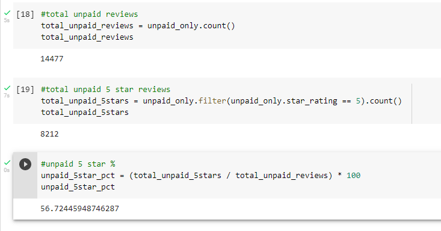
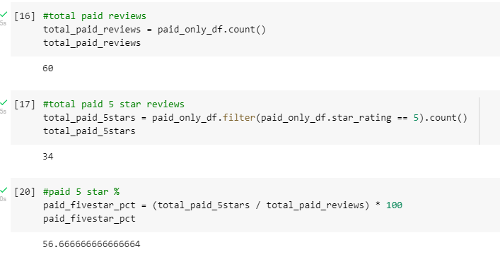

# Amazon_Vine_Analysis
Module 16

## Overview
Analysis performed on behalf of clients of Amazon Vine paid review service. The goal of the analysis was to estimate the value of paying for reviews through this service.
As I'm hunting for a new trumpet for my son and relying on online reviews in part for my purchasing decision, I chose to analyze the paid reviews around musical instruments.

## Results

A total of 14,537 reviews were found in the musical instruments data set. 
Splitting those reviews into paid versus unpaid resulted in 60 paid reviews and 14,477 unpaid reviews.

As a client using this service, one would hope that paying for the service would result in higher levels of 5-star reviews than not paying for this service.

- For unpaid reviews, a total of 8,212 were 5 stars, which represents 56.72% of the review set.

- For paid reviews, a total of 34 were 5 stars, which represents 56.67% of the review set.

## Summary
Overall, the significant difference between the quantity of paid and unpaid reviews leaves me unable to draw a conclusion. The paid reviews represent less than 1% of the data set, which means that all analysis falls well within a margin of error.
However, were I a client paying for a service, I would expect to receive 5 stars on a much larger group than just over half of the reviews I've paid for. Without knowing how the program is structured and how reviews are assigned, I'm unable to make recommendations.
